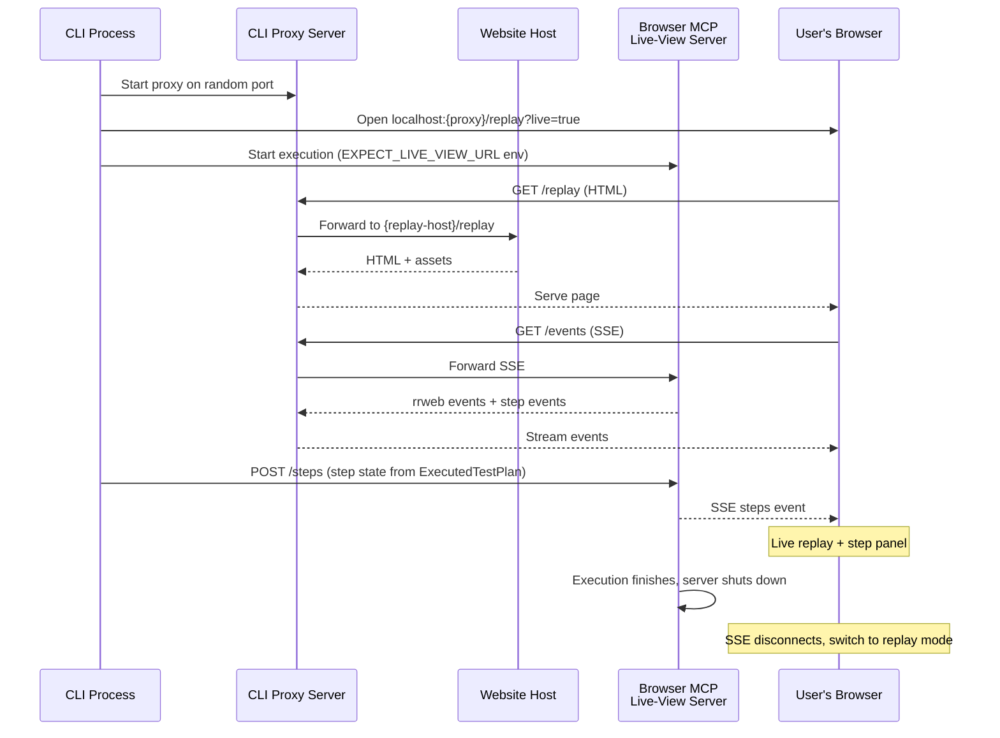

# CLI Replay Proxy

## Architecture

The CLI proxy server is a **Hono** app served via `@hono/node-server`, handling **all** requests on a single `localhost` port:
- Data paths (`/events`, `/latest.json`, `/steps`) are forwarded to the browser MCP's live-view server
- Everything else is reverse-proxied to `{replay-host}` (the website) via the Hono catch-all route

This avoids CORS and mixed-content issues entirely. Hono's lightweight router and streaming primitives make the proxy straightforward — no manual `http.createServer` request/response wiring needed.

## Changes

### 1. Website `/replay` page - SSE live mode

**File:** [`apps/website/app/replay/page.tsx`](apps/website/app/replay/page.tsx)

- Detect `?live=true` query param via `useSearchParams()`
- When live=true: fetch initial events from `/latest.json`, initial steps from `/steps`, then connect to `/events` for SSE
- Parse SSE `replay` events (rrweb `eventWithTime[]`) and `steps` events (`ViewerRunState`)
- Feed events + step state into `ReplayViewer`
- On SSE disconnect (execution done), stop live mode and let user replay the accumulated events
- When live=false (no param): keep existing recording/replay behavior

### 2. ReplayViewer component - step panel and live mode

**File:** [`apps/website/components/replay/replay-viewer.tsx`](apps/website/components/replay/replay-viewer.tsx)

- Add optional `steps` prop matching `ViewerRunState` shape: `{ title, status, summary, steps: { stepId, title, status, summary }[] }`
- When `steps` is provided, render a step status panel above the replay viewer showing plan title, run status badge, and per-step items with status indicators
- Replace hardcoded `stepLabel`/`stepTitle` props with data from the active step in `steps`
- Add `onAddEvents` callback or ref-based API so the page can push new rrweb events into the player dynamically (for live mode)
- Define the step/run state interfaces in a shared types file: `apps/website/lib/replay-types.ts`

### 3. Browser live-view server - CORS headers

**File:** [`packages/browser/src/mcp/live-view-server.ts`](packages/browser/src/mcp/live-view-server.ts)

- Add `Access-Control-Allow-Origin: *` and `Access-Control-Allow-Methods` headers to all responses in `routeRequest`
- Handle `OPTIONS` preflight requests

### 4. Supervisor Executor - pass live view URL

**File:** [`packages/supervisor/src/executor.ts`](packages/supervisor/src/executor.ts)

- Add `liveViewUrl?: string` to `ExecuteOptions`
- When provided, add `{ name: EXPECT_LIVE_VIEW_URL_ENV_NAME, value: liveViewUrl }` to `mcpEnv` alongside the existing replay output path
- Import `EXPECT_LIVE_VIEW_URL_ENV_NAME` from `@expect/browser` (already exported from `packages/browser/src/mcp/index.ts`)

### 5. CLI replay proxy server (new) — Hono

**New file:** `apps/cli/src/utils/replay-proxy-server.ts`

**Dependencies:** Add `hono` and `@hono/node-server` to `apps/cli/package.json`

- `startReplayProxy({ replayHost, liveViewUrl }): Effect<ReplayProxyHandle>`
- Uses **Hono** app with `@hono/node-server` (`serve()`) to create a proxy on a random available port
- Routes defined with Hono's router:
  - `app.get("/events", ...)` -> proxy SSE to `{liveViewUrl}/events` using `fetch()` and streaming the upstream `ReadableStream` body back via Hono's `stream()` helper (`c.body(upstreamResponse.body, { headers })`)
  - `app.get("/latest.json", ...)` -> proxy to `{liveViewUrl}/latest.json`, forward JSON response
  - `app.get("/steps", ...)` -> proxy GET to `{liveViewUrl}/steps`
  - `app.post("/steps", ...)` -> proxy POST to `{liveViewUrl}/steps`, forwarding `c.req.raw.body`
  - `app.all("/*", ...)` -> catch-all reverse proxy to `{replayHost}`: reconstruct the full upstream URL from `c.req.path` + `c.req.query`, `fetch()` from upstream, and return `new Response(upstream.body, { status, headers })`
- Returns `{ url: string, close: Effect<void> }`
- Handle upstream connection failures gracefully (return `c.text("Bad Gateway", 502)` when live-view server isn't ready yet)
- Use Hono's built-in error handling (`app.onError`) for unhandled exceptions

### 6. CLI step state bridge (new)

**New file:** `apps/cli/src/utils/push-step-state.ts`

- `toViewerRunState(executed: ExecutedTestPlan): ViewerRunState` - converts an `ExecutedTestPlan` to the live-view step format
- Maps plan title, derives run status from events (`RunFinished` event -> passed/failed, else -> running), maps steps with their status/summary
- `pushStepState(liveViewUrl: string, state: ViewerRunState): Effect<void>` - POSTs JSON to `{liveViewUrl}/steps`

### 7. CLI entry point - `--replay-host` option

**File:** [`apps/cli/src/index.tsx`](apps/cli/src/index.tsx)

- Add `--replay-host <url>` option to Commander (default: `https://expect.dev`)
- Pass it through to the execution flow

### 8. CLI execution atom - wire up proxy + step pushing

**File:** [`apps/cli/src/data/execution-atom.ts`](apps/cli/src/data/execution-atom.ts)

- Before calling `executor.execute`, pick a random port for the browser live-view server and start the CLI proxy server
- Pass `liveViewUrl: http://localhost:{browser-port}` in the execute options
- Open `http://localhost:{proxy-port}/replay?live=true` in the user's default browser (use `import("open")` or `child_process.exec("open ...")`)
- In `Stream.tap(onUpdate)`, also call `pushStepState` to POST the current step state to the live-view server
- On completion, keep the proxy running (it stays up until CLI exits)
- Show the replay URL in the terminal

### 9. CLI results screen - show replay URL

**File:** [`apps/cli/src/components/screens/results-screen.tsx`](apps/cli/src/components/screens/results-screen.tsx)

- Accept an optional `replayUrl` prop
- Display the replay URL so the user can re-open it

## Port selection strategy

Pick two random ports in the 50000-59999 range:
- One for the browser MCP's live-view server (`liveViewUrl`)
- One for the CLI's proxy server

The proxy server can bind to port 0 via `serve({ fetch: app.fetch, port: 0 })` and read back the assigned port from the server's `address()` — `@hono/node-server` returns the underlying `http.Server` instance.
