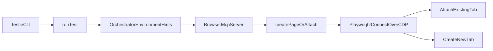

# Live Chrome Mode Plan

## Goal

Add a `testie --live-chrome` mode that reuses the user’s real Chrome session instead of launching a fresh Playwright browser, with support for both:

- attaching to an already-open tab
- opening/navigating a new tab inside the live Chrome session

## Proposed Design

## Implementation Steps

### 1. Extend browser connection types

Update [packages/browser/src/types.ts](/Users/nisarg/Documents/million/browser-tester/packages/browser/src/types.ts) to describe live-Chrome connection options instead of only launch options.

Add fields along these lines:

- `liveChrome?: boolean`
- `cdpEndpoint?: string`
- `tabMode?: "attach" | "new"`
- `tabUrlMatch?: string`
- `tabTitleMatch?: string`
- `tabIndex?: number`
- `ownsBrowser?: boolean` on the returned session result so shutdown logic knows whether it launched the browser or attached to a user-owned one.

### 2. Add CDP attach path in browser creation

Refactor [packages/browser/src/create-page.ts](/Users/nisarg/Documents/million/browser-tester/packages/browser/src/create-page.ts) so it can either:

- keep the current `chromium.launch(...)` flow
- or call Playwright `chromium.connectOverCDP(...)` for live Chrome

Behavior for live mode:

- if `tabMode` is `attach`, pick an existing page by `tabIndex`, URL match, or title match
- if `tabMode` is `new`, reuse an existing context and create a new page, optionally navigating to a URL
- skip cookie injection in live mode because the browser session already has the user’s state
- disable or gracefully degrade video recording in live mode if Playwright cannot reliably save artifacts for attached sessions

### 3. Teach MCP about live Chrome sessions

Update [packages/mcp/src/server.ts](/Users/nisarg/Documents/million/browser-tester/packages/mcp/src/server.ts).

Current `open` assumes “launch if needed, otherwise navigate”. Expand the MCP surface so the agent can explicitly choose live-browser behavior:

- extend `open` with live-Chrome fields for the common path
- add a dedicated `attach` tool for explicit existing-tab attachment
- keep using existing `tab_list`, `tab_create`, and `tab_switch` tools for post-attach tab management

Also update session lifecycle handling:

- when `ownsBrowser` is true, keep current close behavior
- when attached to live Chrome, disconnect cleanly without treating the user’s Chrome like an ephemeral browser process
- avoid closing the whole browser when the last attached tab is closed unless that tab/context was created by browser-tester

### 4. Thread live-mode hints through orchestrator

Update [packages/orchestrator/src/types.ts](/Users/nisarg/Documents/million/browser-tester/packages/orchestrator/src/types.ts) and the prompt builders in:

- [packages/orchestrator/src/plan-browser-flow.ts](/Users/nisarg/Documents/million/browser-tester/packages/orchestrator/src/plan-browser-flow.ts)
- [packages/orchestrator/src/execute-browser-flow.ts](/Users/nisarg/Documents/million/browser-tester/packages/orchestrator/src/execute-browser-flow.ts)

Add environment hints for live mode, such as:

- `liveChrome`
- `liveChromeTabMode`
- optional tab selection hints

Prompt changes should instruct the agent that in live mode it can:

- attach to an existing tab when continuing an in-progress user workflow makes sense
- open a fresh tab in the live browser when it needs a cleaner path

### 5. Add CLI wiring for `testie --live-chrome`

Update the CLI entry and run path in:

- [apps/cli/src/index.tsx](/Users/nisarg/Documents/million/browser-tester/apps/cli/src/index.tsx)
- [apps/cli/src/utils/run-test.ts](/Users/nisarg/Documents/million/browser-tester/apps/cli/src/utils/run-test.ts)

Expose a first-pass UX like:

- `testie --live-chrome`
- optional follow-up flags for tab behavior, for example `--attach-tab`, `--new-tab`, `--tab-url`, `--tab-title`, or `--tab-index`

Default behavior recommendation:

- `--live-chrome` without extra tab selectors defaults to `new` tab mode for safety and predictability
- explicit flags opt into attach-existing-tab behavior

### 6. Guardrails and prerequisites

Document and enforce the runtime assumptions:

- Chrome remote debugging must be enabled via `chrome://inspect/#remote-debugging`
- this first version should target Google Chrome on macOS before broadening to other Chromium browsers
- if CDP is unavailable, fail with a clear actionable error rather than silently falling back to a fresh browser

A good place for user-facing messaging is the CLI flow in [apps/cli/src/utils/run-test.ts](/Users/nisarg/Documents/million/browser-tester/apps/cli/src/utils/run-test.ts).

### 7. Verify behavior manually and with repo checks

Validation should cover:

- fresh browser mode still works unchanged
- `--live-chrome --new-tab` connects and opens a new tab in the existing session
- `--live-chrome --attach-tab` can target an existing tab by URL/title/index
- MCP `tab_list` and `tab_switch` still work after attach
- session close/disconnect does not shut down the user’s Chrome session unexpectedly

Run the repo-standard checks after implementation:

- `pnpm lint`
- `pnpm format:check`

## Key Risks

- Attached-session lifecycle is different from launched-browser lifecycle, especially around `close` and tab cleanup.
- Video capture may not behave the same in attached mode and may need to be disabled or made best-effort.
- Existing-tab attach is inherently less deterministic than new-tab mode, so the agent prompt and CLI defaults should bias toward safer behavior.

## Most Important Files

- [packages/browser/src/types.ts](/Users/nisarg/Documents/million/browser-tester/packages/browser/src/types.ts)
- [packages/browser/src/create-page.ts](/Users/nisarg/Documents/million/browser-tester/packages/browser/src/create-page.ts)
- [packages/mcp/src/server.ts](/Users/nisarg/Documents/million/browser-tester/packages/mcp/src/server.ts)
- [packages/orchestrator/src/types.ts](/Users/nisarg/Documents/million/browser-tester/packages/orchestrator/src/types.ts)
- [packages/orchestrator/src/plan-browser-flow.ts](/Users/nisarg/Documents/million/browser-tester/packages/orchestrator/src/plan-browser-flow.ts)
- [packages/orchestrator/src/execute-browser-flow.ts](/Users/nisarg/Documents/million/browser-tester/packages/orchestrator/src/execute-browser-flow.ts)
- [apps/cli/src/index.tsx](/Users/nisarg/Documents/million/browser-tester/apps/cli/src/index.tsx)
- [apps/cli/src/utils/run-test.ts](/Users/nisarg/Documents/million/browser-tester/apps/cli/src/utils/run-test.ts)
